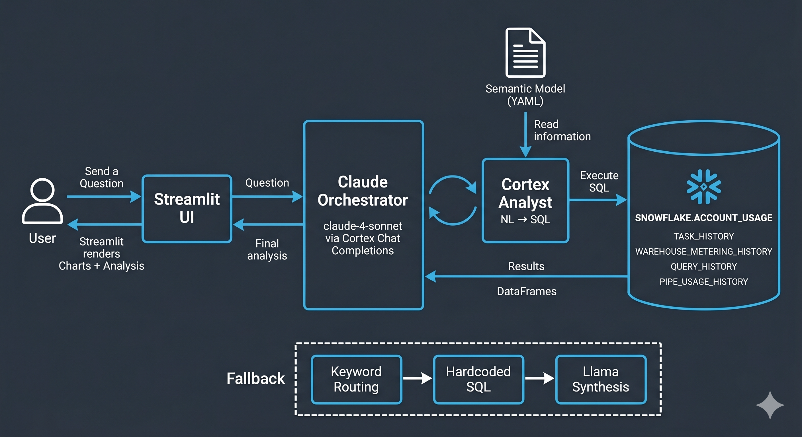

# Snowflake Data Ecosystem Analyst



A Streamlit-in-Snowflake app that answers plain-English questions about your Snowflake data platform. Ask about pipeline failures, warehouse costs, slow queries, or ingestion health — and get back live charts, data tables, and an AI-generated analysis with specific numbers and actionable recommendations.

## What it does

1. Claude receives the question and decides which data domains to query
2. For each domain, it calls `query_data(question)` — a tool backed by Cortex Analyst
3. Cortex Analyst translates the sub-question into SQL using `semantic_model.yaml`
4. SQL executes against `SNOWFLAKE.ACCOUNT_USAGE` and returns a DataFrame
5. Results are fed back to Claude, which may call additional domains
6. Claude synthesizes all results into a concise analysis with specific numbers and 2-3 actionable recommendations
7. Streamlit renders bar charts, data tables, and the final markdown summary

Conversation history is preserved within the session for follow-up questions.

## Data domains

| Domain | Source view | What it covers |
|---|---|---|
| Pipeline Health | `TASK_HISTORY` | Task execution outcomes, failure rates, durations, auto-suspensions |
| Warehouse Credits | `WAREHOUSE_METERING_HISTORY` | Hourly credit consumption, idle warehouses, daily spend trends |
| Query Performance | `QUERY_HISTORY` | Execution time, bytes scanned, cache hit rate, queue wait, spill |
| Snowpipe Ingestion | `PIPE_USAGE_HISTORY` | Credits consumed, files loaded, daily ingestion trends |
| Dynamic Table Refreshes | `DYNAMIC_TABLE_REFRESH_HISTORY` | Refresh failure rates, durations, upstream failures |
| COPY Bulk Loads | `COPY_HISTORY` | Rows loaded, success rates, load volumes |

## Example questions

- Which tasks have the highest failure rate in the last 7 days?
- Which warehouses consumed the most credits this week?
- Which queries ran the slowest in the last 7 days?
- Which warehouses are idle or underutilized?
- Which tasks are taking the longest to run on average?
- How many rows were loaded via COPY commands in the last 7 days?

## Setup

### Prerequisites

- Snowflake account with access to `SNOWFLAKE.ACCOUNT_USAGE`
- Snowflake Cortex enabled (Cortex Analyst + Chat Completions)
- Snowpark-enabled Streamlit (runs natively inside Snowflake)

### Deployment

1. Upload `semantic_model.yaml` to the stage referenced in the app:
   ```
   @PIPELINE_MONITOR.TASKS.CORTEX_STAGE
   ```

2. Deploy `streamlit_app.py` as a Streamlit in Snowflake app in the `PIPELINE_MONITOR.TASKS` schema.

3. The app picks up the active Snowpark session automatically — no credentials needed in the code.

## Project structure

```
streamlit_app.py       # Streamlit UI — layout, chart rendering, conversation history
agent.py               # Agentic loop — Claude orchestration, Cortex Analyst integration, fallback path
tools.py               # Fallback SQL tools — hardcoded queries per domain + Llama synthesis
semantic_model.yaml    # Cortex Analyst semantic model — NL-to-SQL mappings for all 6 domains
```
