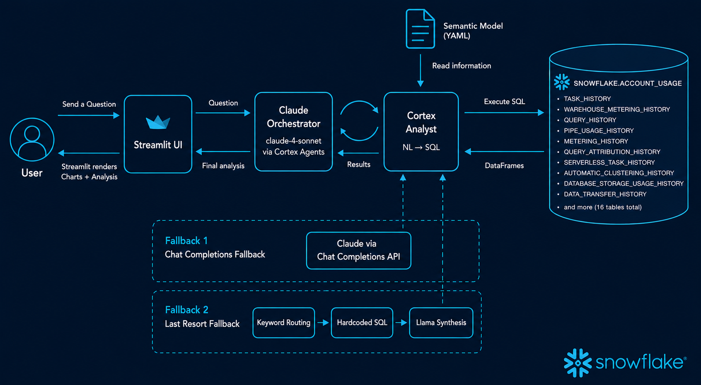

# Snowflake Data Ecosystem Analyst



A Streamlit-in-Snowflake app that answers plain-English questions about your Snowflake data platform. Ask about pipeline failures, warehouse costs, slow queries, bill spikes, or ingestion health and get back live charts, data tables, and an AI-generated analysis with specific numbers and actionable recommendations.

## How it works

The app uses a 3-tier architecture with automatic fallback:

**Tier 1 — Cortex Agents (primary)**
Snowflake's Cortex Agents runtime orchestrates Claude (claude-4-sonnet). Claude reads the question, decides which sub-questions to ask, and calls the built-in Cortex Analyst tool once per domain. Cortex Analyst translates each sub-question into SQL using `semantic_model.yaml` and executes it against `SNOWFLAKE.ACCOUNT_USAGE`. Claude synthesizes all results into a final analysis with specific numbers and 2-3 actionable recommendations.

**Tier 2 — Chat Completions (fallback)**
If Cortex Agents is unavailable, the same Claude model runs via the Chat Completions API with a manual agentic loop. Same outcome, different runtime.

**Tier 3 — Keyword routing (last resort)**
If both Claude paths fail, regex keyword matching in `agent.py` selects hardcoded SQL tools from `tools.py`. Results are synthesized by Llama/Mistral via `SNOWFLAKE.CORTEX.COMPLETE`.

Conversation history is preserved within the session for follow-up questions.

## Data domains

### Operational health

| Domain | Source view | What it covers |
|---|---|---|
| Pipeline Health | `TASK_HISTORY` | Task execution outcomes, failure rates, durations, auto-suspensions |
| Warehouse Credits | `WAREHOUSE_METERING_HISTORY` | Hourly credit consumption, idle warehouses, daily spend trends |
| Query Performance | `QUERY_HISTORY` | Execution time, bytes scanned, cache hit rate, queue wait, spill |
| Snowpipe Ingestion | `PIPE_USAGE_HISTORY` | Credits consumed, files loaded, daily ingestion trends |
| Dynamic Table Refreshes | `DYNAMIC_TABLE_REFRESH_HISTORY` | Refresh failure rates, durations, upstream failures |
| COPY Bulk Loads | `COPY_HISTORY` | Rows loaded, success rates, load volumes |

### Cost intelligence

| Domain | Source view | What it covers |
|---|---|---|
| Total Credit Spend | `METERING_HISTORY` | Cross-service credit breakdown, week-over-week, month-over-month |
| Daily Credit Trends | `METERING_DAILY_HISTORY` | Daily billed credits by service type |
| Query Cost Attribution | `QUERY_ATTRIBUTION_HISTORY` | Per-query credits, top-spending users, expensive query patterns |
| Serverless Task Costs | `SERVERLESS_TASK_HISTORY` | Credits consumed by serverless tasks |
| Container Services | `SNOWPARK_CONTAINER_SERVICES_HISTORY` | Compute pool credit consumption |
| Storage | `DATABASE_STORAGE_USAGE_HISTORY` | Active, failsafe, and hybrid table storage by database |
| Data Transfer | `DATA_TRANSFER_HISTORY` | Cross-region egress by cloud and transfer type |
| Auto-Clustering | `AUTOMATIC_CLUSTERING_HISTORY` | Clustering credits by table |

### Governance

| Domain | Source view | What it covers |
|---|---|---|
| Table Access | `ACCESS_HISTORY` | Most accessed tables, unique users, last accessed time |
| Object Dependencies | `OBJECT_DEPENDENCIES` | Downstream dependency graph for impact analysis |

## Example questions

- Which tasks have the highest failure rate in the last 7 days?
- Which warehouses consumed the most credits this week?
- Which queries ran the slowest in the last 7 days?
- Which warehouses are idle or underutilized?
- Why is my Snowflake bill high this week?
- Which users are spending the most on queries?
- Which services drove the most credit consumption last month?
- Which tables are driving auto-clustering expenses?

## Setup

### Prerequisites

- Snowflake account with access to `SNOWFLAKE.ACCOUNT_USAGE`
- Snowflake Cortex enabled (Cortex Agents + Cortex Analyst + Chat Completions)
- Snowpark-enabled Streamlit (runs natively inside Snowflake)

### Deployment

1. Upload `semantic_model.yaml` to the stage referenced in the app:
   ```
   @ANALYTICS.STREAMLIT_APPS.CORTEX_STAGE
   ```

2. Deploy `streamlit_app.py` as a Streamlit in Snowflake app.

3. The app picks up the active Snowpark session automatically — no credentials needed in the code.

## Project structure

```
streamlit_app.py       # Streamlit UI — layout, chart rendering, conversation history
agent.py               # Orchestration — Cortex Agents primary, Chat Completions fallback, keyword routing last resort
tools.py               # Fallback SQL tools — hardcoded queries per domain + Llama synthesis
semantic_model.yaml    # Cortex Analyst semantic model — NL-to-SQL mappings across 16 Account Usage tables
```
